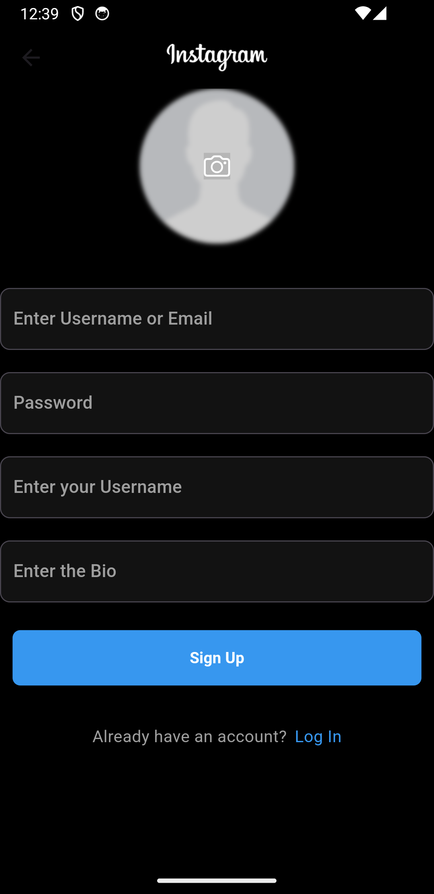

# Instagram_clone_flutter

A full-stack Instagram clone built using Flutter and Firebase, featuring essential Instagram functionalities including authentication, photo storage, and real-time interactions.

# Introduction

This project replicates the core features of Instagram, allowing users to share photos with descriptions, interact with posts through likes and comments, follow other users, view user profiles with post counts, and search for users by username. It utilizes Flutter for the frontend to create a native mobile app experience and Firebase for real-time database, authentication, and storage services.

# Visual Representation 

  
 
  
 
 
 

      
  

   

# Features

- Authentication: Sign in and sign up functionality with Firebase Authentication.
- Posting: Users can upload photos with/without descriptions.
- Real-time Updates: Likes,comments,following,follow and posts update in real-time.
- Commenting: Users can comment on posts.
- Liking: Like posts and comments with real-time state updates.
- Following: Follow and unfollow other users.
- User Profiles: View profiles with post counts, follower count, and following count.
- Search: Search for users by username.
- Photo Storage: Firebase storage integration for storing user-uploaded photos.
- Navigation: Bottom navigation bar for easy app navigation.

# Installation

To run this project locally, follow these steps:

- Clone the repository:

git clone https://github.com/your-username/instagram_clone.git

- Navigate into the project directory:

cd instagram_clone

- Install dependencies:

flutter pub get

- Run the app:

flutter run

# Usage

- Authentication: Sign in or sign up using your credentials.
- Posting: Tap on the camera icon to upload a new image with a description.
- Interaction: Like posts by tapping the heart icon, and add comments by tapping the comment icon.
- Following: Navigate to a user's profile and tap "Follow" or "Unfollow" to manage your connections.
- Search: Use the search bar to find users by username.

# Contributing
We welcome contributions to improve Instagram Clone. To contribute:

- Fork the repository and create your branch .
- Make your changes and test thoroughly.
- Issue a pull request describing your changes.

Please follow our Code of Conduct and Contribution Guidelines.

# Connect with Me

Connect with me on LinkedIn: https://www.linkedin.com/in/abinash-karki/

# License

This project is licensed under the MIT License.
